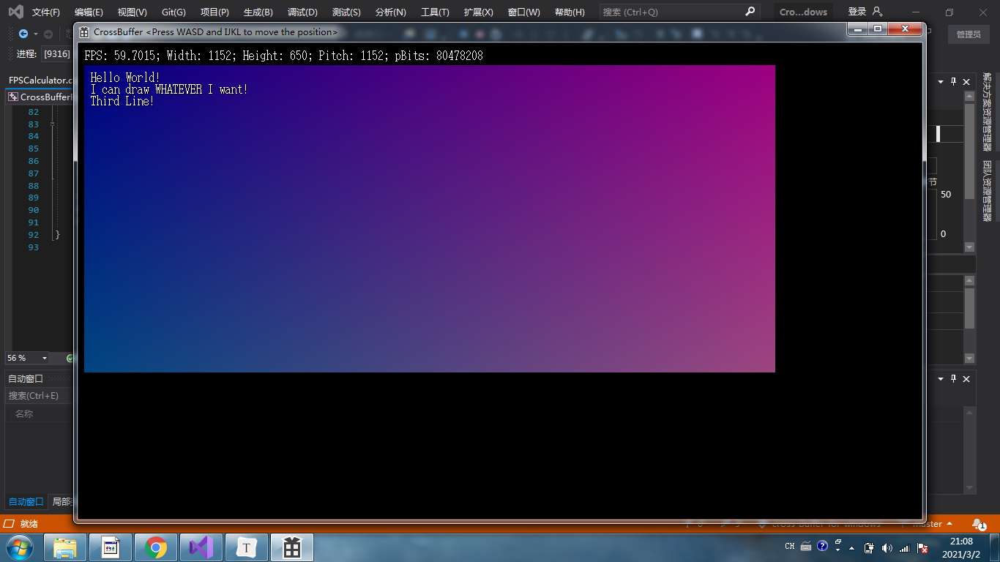
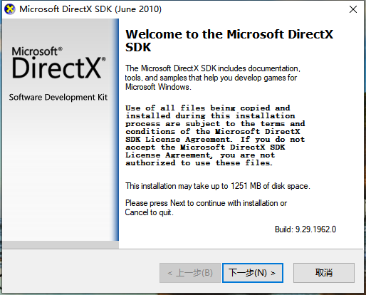

# CrossBufferForWindow

基于DirectX9.0的FrameBuffer实现，可以帮助你在Windows环境下读写显存。



# 如何把项目运行起来（环境配置）

1.下载并运行DirectX9.0 SDK安装包（DXSDK_Jun10.exe，2010年6月发布），由于时间久远，安装包比较难找，在这里放两个链接：

Gitee仓库:[https://gitee.com/SirJackie/good-software-backup](https://gitee.com/SirJackie/good-software-backup) ，clone下来后有一个DXSDK_Jun10文件夹，里面有分块的压缩包(DXSDK_Jun10.part01.rar到DXSDK_Jun10.part14.rar)，用WinRAR可以解压，得到一个大小571.7MB的DXSDK_Jun10.exe。

还有百度网盘的下载链接，只要你不嫌慢的话。侵删，链接: [http://pan.baidu.com/s/1gfkqSMZ](http://pan.baidu.com/s/1gfkqSMZ) 密码: r6my

得到DXSDK_Jun10.exe之后，双击运行：



2.安装路径**<u>务必</u>**安装到到C:\Program Files (x86)\Microsoft DirectX SDK (June 2010)，**<u>否则你就需要重新配置Visual Studio项目</u>**（重新配置的教程见[ProjectConfigurations.md](./ProjectConfigurations.md)）。默认地址就是这个。


3.安装程序最终会出现S1023错误，但这是正常现象，不影响使用。


4.安装完成后打开仓库中的CrossBufferForWindow.vcxproj，就会自动在VS中打开CrossBufferForWindow项目。点击画面上方的“本地Windows调试器”进行编译运行。不出所料的话，你应该会看到下图所示的Demo。Windows7环境轻松60帧，Windows10环境只能跑到48-50帧，这可能是因为系统的实现不同导致的。


# APIs

CrossBuffer希望提供一个跨平台的显存读写环境，这样你的代码就可以轻松复用，无需移植！

CrossBuffer在各个平台上都提供Main.h文件，你只需要修改Main.h，你就可以操作显存、键盘、鼠标、计时等等设备和功能，还能轻松跨平台，不用担心兼容性问题。同时你也应该仅修改Main.h和创建基于标准CrossBuffer的头文件，因为轻易修改CrossBuffer可能导致与其他平台不兼容。

最简单Main.h包含这些内容：

```c++
#include "./CrossBufferLayer/CrossBuffer.h"


/* Define Window Class Properties */
#define WindowClassName L"CrossBuffer Class"
#define WindowTitle     L"CrossBuffer <Press WASD and IJKL to move the position>"

void Setup(FrameBuffer &fb, Keyboard kb, int deltaTime) {}

void Update(FrameBuffer &fb, Keyboard kb, int deltaTime) {}

```

Setup()在显存建立后第一帧被调用，参数：

- fb：显存
- keyboard：键盘对象
- deltaTime：这一帧和上一帧的间隔时间（毫秒为单位，在Setup中由于是第一帧，所以为0）

Update()在显存建立后除了第一帧以外的每一帧被调用，参数：

- fb：显存

- keyboard：键盘对象

- deltaTime：这一帧和上一帧的间隔时间（毫秒为单位，在Setup中由于是第一帧，所以为0）

## FrameBuffer对象

要获得一个FrameBuffer对象，你可以使用Start()或者Update()函数提供的fb参数，也可以创建一个：

```c++
FrameBuffer fb2(Width, Height);
```

你可以使用这行代码修改任意点的像素：

```c++
SetPixel(fb, x, y, color);
```

创建color颜色对象可以这样做：

```c++
Color color = CreateColor(0, 144, 255);
```

你也可以合在一起做：

```c++
SetPixel(fb2, x, y, CreateColor(0, 144, 255));
```

要获取宽和高，你可以这样做：

```c++
int width  = fb.Width;

int height = fb.Height;
```

同时，你可以使用fb.Draw()来显示字符串：

```c++
fb.Draw("Hello World!\n");
```

还可以使用fb.Draw()来将另外一个fb绘制到这个fb上：

```c++
fb.Draw(fb2, StartX, StartY);
```

## Keyboard对象

说明文档待续。

## FPSCalculator对象

说明文档待续。

## 更多使用方法

这些类和对象的使用方法参见工程中的Main.h文件，里面有详细的注释和Demo。如果有问题，请Issue我，我看到后会进行解释。

Enjoy it！

# 关于开源协议

仓库中CrossBufferForWindow本身，以及通过该程序衍生得产品，如Demo视频，均属于开源软件，遵守GNU通用公共许可证，即GNU GPL。

GNU GPL协议授予程序接受人以下权利，或称“自由”：

- 以任何目的运行此程序的自由；

- 再发行复制件的自由；

- 改进此程序，并公开发布改进的自由。

GNU GPL不会授予许可证接受人无限的权利。再发行权的授予需要许可证接受人开放软件的源代码，及所有修改。且复制件、修改版本，都必须以GPL为许可证，这是为了确保任何使用者不会独自占有开源软件。使用、复制或更改CrossBufferForWindow的程序接受人视为同意GNU GPL协议，必须再次开源其更改后的派生物（如源代码等），否则将追究法律责任。

关于协议版本，CrossBufferForWindow使用GPL v2协议。

关于GPL v2协议，上述说明仅做参考，具体细节请以LICENSE为准，

CrossBufferForWindows原作者杰基爵士SirJackie(曾用名Jackie Lin、Jakes、lyj00912，GitHub：https://github.com/SirJackie，Gitee：https://gitee.com/SirJackie，Bilibili：https://space.bilibili.com/354290931 ，博客园：https://www.cnblogs.com/SirJackie)保留一切解释权。